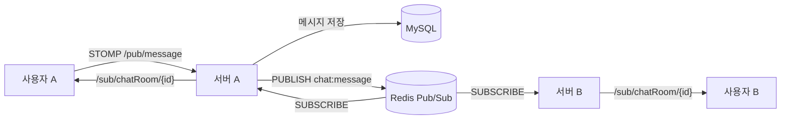

# Groomeet — 뷰티 디렉터 매칭 플랫폼 (Backend)

뷰티 디렉터(헤어·메이크업 전문가)와 소비자를 매칭하는 플랫폼 **Groomeet**의 백엔드입니다.
실시간 채팅 · 견적 · 위치 기반 매칭 · LLM 기반 추천을 제공합니다.

> 서비스는 출시 전 단계에서 정리되었고, 이 레포는 포트폴리오 공개용 스냅샷입니다.
> 민감 설정값은 환경변수/GitHub Secrets로 분리했고, 공개 스냅샷에는 비밀값 없는 설정만 남겼습니다.

## 기술 스택

Java 17 · Spring Boot 3.5 · MySQL · Redis · WebSocket/STOMP · JPA/QueryDSL · AWS S3 · Firebase · PostgreSQL/pgvector(PoC)

## 핵심 구현

### 1. LLM 기반 디렉터 추천 / 요청서 생성

AI 응답을 화면에 그대로 노출하면 백엔드가 추천 흐름을 제어할 수 없는 문제를, 구조화 JSON 출력 강제·파싱과 멀티턴 대화 컨텍스트 영속(텍스트+이미지)으로 해결했습니다. 정보가 부족하면 추가 질문을, 충분하면 디렉터 추천을 반환하는 분기 구조이며, AI 제공자는 `AiChatProvider` 인터페이스로 추상화해 모델 교체에 대비했습니다.

- 대화방/메시지 영속 + 추천/요청서 파이프라인: `module/member/prompt`
- AI 제공자 추상화: `shared/ai/provider`

### 2. WebSocket/STOMP 실시간 채팅 + 다중 서버 확장 구조

Spring 기본 `SimpleBroker`는 단일 서버 안에서만 동작해 다중 서버 환경에서 메시지가 전달되지 않는 문제를, 출시 전 단계에서 새 인프라(Kafka 등)를 늘리는 대신 기존 Redis의 Pub/Sub으로 해결했습니다. 연결 생존은 STOMP 5초 heartbeat와 스케줄러 기반 Redis 세션 TTL(20초) 갱신의 2층으로 관리해, 서버가 비정상 종료돼도 좀비 세션이 자동 정리됩니다.



### 3. pgvector 의미 유사도 검색 PoC → [`poc/pgvector-semantic-search`](../../tree/poc/pgvector-semantic-search) 브랜치

키워드 검색으로는 사용자의 자연어 요구와 표현이 다른 포트폴리오를 놓치는 문제를 검증하기 위한 PoC입니다. 포트폴리오 제목·본문을 OpenAI `text-embedding-3-small`(1536차원)로 임베딩하고, PostgreSQL pgvector의 HNSW 인덱스 + cosine 검색으로 유사 포트폴리오를 찾습니다.

- 운영 MySQL을 건드리지 않도록 **PostgreSQL 벡터 저장소를 분리한 멀티 데이터소스** 구성 (`common/config/PostgresDataSourceConfig.java`)
- 검색은 벡터 DB에서 후보 ID만 얻고 원본은 MySQL에서 조회 — 정합성 기준은 운영 DB
- 동기화는 관리자 수동 트리거 + 새벽 배치(임베딩 누락분 채움)로 구성, 실시간 반영·삭제 전파는 PoC 범위 밖

PoC 변경분 전체는 [main...poc/pgvector-semantic-search 비교](../../compare/main...poc/pgvector-semantic-search)에서 한눈에 볼 수 있습니다.
핵심 코드는 PoC 브랜치의 `src/main/java/com/motd/be/module/member/portfolio_embedding/` 참고.

## 레이어 구조

```
Controller / Scheduler / EventListener
        → Facade
        → Service → QueryService / CommandService
        → Repository
```

## AI 협업 환경

`.claude/skills/`에 프로젝트 전용 코딩 규칙(아키텍처·API·테스트·RestDocs 등)을 스킬로 정의해, Plan 작성 → 스킬 기반 구현 → AI 코드 리뷰의 3단계 파이프라인으로 개발했습니다. `CLAUDE.md` 참고.
